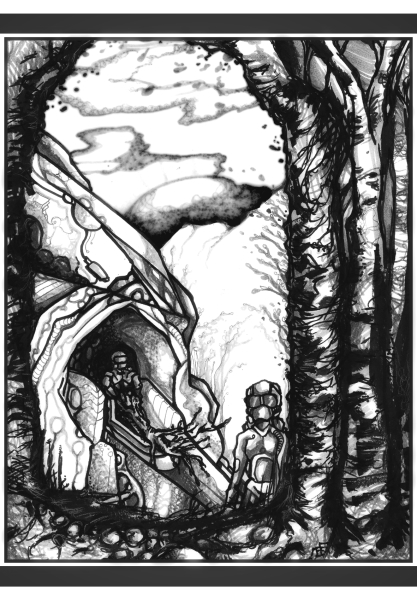

# gbmj.net

## My personal website, built with [litesite.py](https://github.com/gbmj/litesite)

### If you're checking this repo out as an example of litesite:
The repo uses three copies of litesite: litesite-gbmj.py in the root, litesite-stories.py in the stories/ folder, and litesite-cancer.py in the cancer-blog/folder. Feel free to browse and compare to see what litesite looks like in action. Notes:

- I use three different infile extensions so litesite-gbmj can process relevant subfolders (such as blog/) without touching the independent stories/ and cancer-blog/ files. (Tip: Using unique file extensions is good future-proofing even if you don't need it at the start.)
- all three sites demonstrate the use of litesite's built-in html placeholders, in the cmn/ files and some of the *.story / *.cancer / *.gbmj files.
- there's no index.story file in stories/, so this is an example of using litesite to generate index.html from scratch.
- stories/ is also an example of using custom frontmatter tags and placeholders.
- I point all three sites to the same css file, to enforce consistent styling across my website, but you could point them at three different files to make each site unique.
- I've named my pre and post files 'header' and 'footer', because that's what I'm using them for, but pre and post can be anything that's valid in the &lt;body&gt; of a page.
- these sites use a fairly minimalist design ethic, but you can do whatever you like. Aside from the generated table of contents, litesite doesn't dictate form or function; it just takes what you give it and stitches the parts together. 

### Licensing

#### Creative content
Shield: [![CC BY-SA 4.0][cc-by-sa-shield]][cc-by-sa]

All creative content except custom story artwork is licensed under a
[Creative Commons Attribution-ShareAlike 4.0 International License][cc-by-sa].

[![CC BY-SA 4.0][cc-by-sa-image]][cc-by-sa]

[cc-by-sa]: http://creativecommons.org/licenses/by-sa/4.0/
[cc-by-sa-image]: https://licensebuttons.net/l/by-sa/4.0/88x31.png
[cc-by-sa-shield]: https://img.shields.io/badge/License-CC%20BY--SA%204.0-lightgrey.svg

#### Custom story artwork
These items are copyrighted by their respective artists; all rights reserved.

&copy; Darryl Knickrehm, https://dariru.com

&copy; Matt D. Edginton, https://madoosk.com

&copy; Zebi Damen

### Code
All styling (html and css) is in the public domain.

The [litesite script](https://github.com/gbmj/litesite) is licensed under a GPLv3 license.

