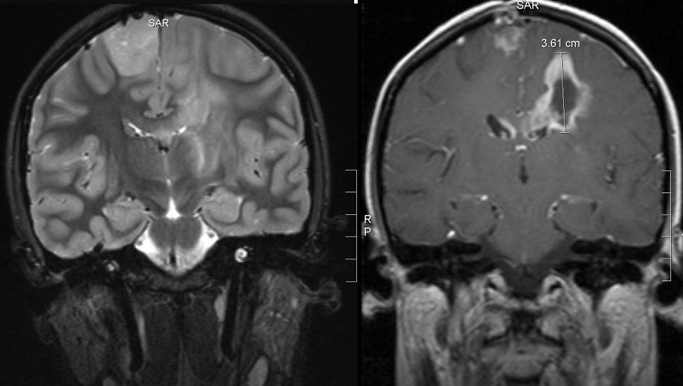
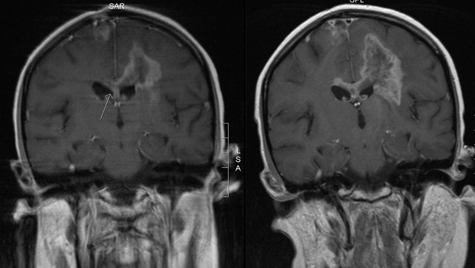

# Meghan's MRIs

*first visit? click to read*

MRI images are flipped, meaning what you see on the left is actually on the right side of the brain and vice versa. We selected these images as carefully as we could, but they aren’t shots of exactly the same location in exactly the same position. Moreover, the images were taken on different equipment using different contrast fluids, which is why the tumor seems brighter on one image than on another. Last but not least, reading MRI images is an art and a science; we hope these images are helpful to you on your journey, but please don’t use them to draw conclusions about your own MRIs. You can click on each image for a larger view.

These images show the positive effect Meghan's six weeks of radiation and vincristine-cisplatin had on the top right tumor (left in the image):

<figure>

<figcaption>**(l) 27 Oct 2006**: a month after her first MRI, before the biopsy, 3 weeks before treatment began \
**(r) 10 Apr 2007**: 3 months after the end of radiation and vincristine-cisplatin</figcaption>
</figure>

These images show that the rest of the tumor hasn't seemed to notice there's been treatment going on:

<figure>

<figcaption>**(l) 27 Oct 2006**: a month after her first MRI, before the biopsy, 3 weeks before treatment began \
**(r) 27 Feb 2007**: 1.5 months after the end of radiation and vincristine-cisplatin. The dark center in the tumor is necrosis (dead tissue), which could be from radiation; it’s also a hallmark of glioblastoma multiforme (GBM): a GBM grows so quickly its blood supply can’t keep up with it, and the center dies off.
</figcaption>
</figure>

From there, it only gets worse:

<figure>

<figcaption>**(l) 10 Apr 2007**: another 1.5 months later, the top tumor is stable, but the central one is growing, and now it's crossed the midline (arrow). \
**(r) 21 May 2007**: Another 1.5 months later; the growth is dramatic.  
</figcaption>
</figure>

The images below are another view on the growth you see above. The top series is from 10 April 2007; the bottom from 21 May. Each series starts at the midline in the brain (the dividing line between left and right hemispheres) and proceeds out toward Meghan's left ear. Note that the April scans begin slightly closer to the midline (you can see Meghan's spinal cord in the first image). This means each April image comes “before” (closer to the midline than) its corresponding May image.

<figure>

</figure>
<figure>

</figure>

On 29 Aug 2007 Meghan has another MRI scan, after three relatively stable months. The existing tumor sites haven't changed since the May MRI, but there’s a new kid in town: a 1.5-cm lesion on Sadie’s medulla oblongata. The medulla oblongata is responsible for heart rate, breathing, swallowing, and vomiting and controls several skeletal muscles involved with speech.

<figure>

<figcaption>**29 Aug 2007**: 3 months after the previous MRI, the tumor has spread into the brain stem (arrow).
</figcaption>
</figure>
