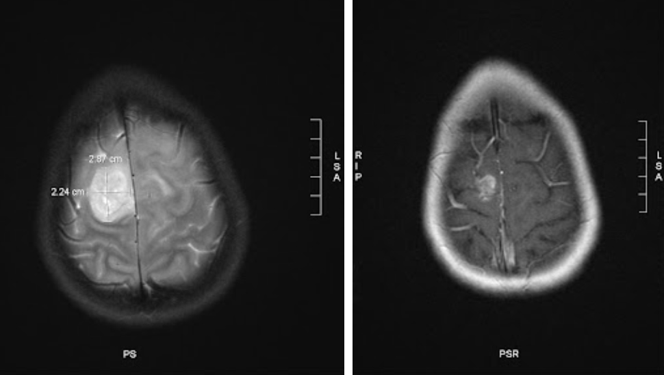

# Meghan's MRIs

*first visit? click to read*

MRI images are flipped, meaning what you see on the left is actually on the right side of the brain and vice versa. We selected these images as carefully as we could, but they aren’t shots of exactly the same location in exactly the same position. Moreover, the images were taken on different equipment using different contrast fluids, which is why the tumor seems brighter on one image than on another. Last but not least, reading MRI images is an art and a science; we hope these images are helpful to you on your journey, but please don’t use them to draw conclusions about your own MRIs. You can click on each image for a larger view.

These images demonstrate the positive effect radiation and vincristine-cisplatin had on the top right tumor:

<figure>

<figcaption>**(l) 27 Oct 2006**: a month after her first MRI, before the biopsy, 3 weeks before treatment began \
**(r) 10 April 2007**: 3 months after the end of radiation and vincristine-cisplatin</figcaption>

These series of images show changes to the tumor in the left hemisphere between August 10 (top series) and September 18 (bottom series), 2006. Each series starts at the midline in the brain (the dividing line between left and right hemispheres) and proceeds out toward Sadie’s left ear. Note that the August 10 scans begin slightly closer to the midline (you can see Sadie’s spinal cord in the first image) than the September 18 scans. This means each August 10 image comes “before” (closer to the midline than) its corresponding September 18 image.

## The New Brain Stem Tumor