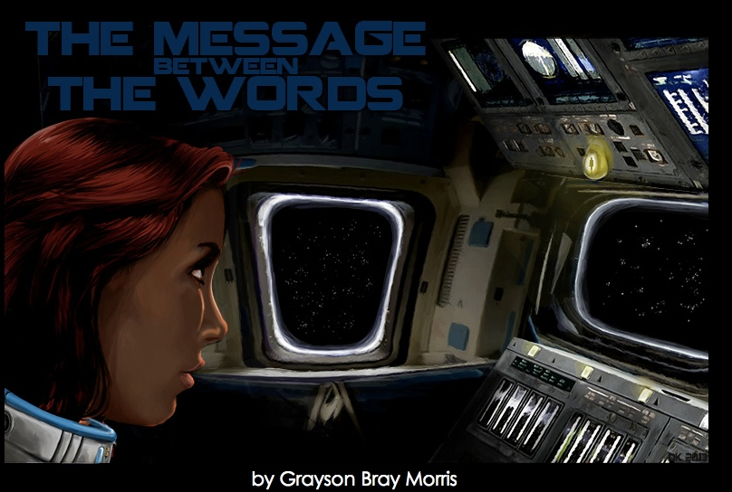

# The Message Between the Words {.has-subtitle}

by <a href="DOMAIN_URL_PH">Grayson Bray Morris</a>

<figure>

<figcaption>ARTIST_PH</figcaption>
</figure>

Ankti Remsi stared at the droplet marring the smooth surface of her
shuttle's console. It looked like ordinary condensation. Any other cargo
pilot would have wiped it with a sleeve and been done. But Ankti Remsi
overthought things.

She wouldn't have said that two days ago. Two days ago she'd still
thought of herself as a clever pilot with a solid head on her shoulders.
A pilot who'd outlived a dozen colleagues who moved too quickly, went to
work without thinking, and got themselves asphyxiated or irradiated or
blown to kingdom come. Two days ago she'd been right to think first and
act second.

But the world had shifted since then.

Erwin Glastrip had married.

She'd heard the news yesterday in a stopover bar on Erseti. Most of the
faces in the bar were familiar: old classmates, pilots who'd come to her
for help with repairs, the usual regulars she saw in every pilots'
hangout across the Gorsan system. She ordered a drink at the bar and
took one of the empty tables near the center, surrounding herself with
camaraderie. She listened to the voices at the neighboring tables,
hearing what had changed in their owners' lives. She liked hearing about
their lives.

Then someone at a table behind her said he'd attended Erwin Glastrip's
wedding. A ball of pain punched her hard, right in the middle of her
chest. The illusion of camaraderie vanished and she was outside her
body, looking down at herself alone. Always alone. She knew what the
people around her liked and loathed and wanted, and they didn't even see
her. Their lives went on whether she was there to listen or not. She
wasn't part of anything. She was invisible, a ghost walking through the
world of the living.

In that instant, Ankti knew she would die a lonely death after a lonely
life. Even worse, she knew what her older brother Berend would say.
*Venture it, Ankti*.

Easy for a natural conversationalist like him. Impossible for her.

------------------------------------------------------------------------

[The droplet on her console]{.newthought} had grown since she first
noticed it. Soon it might compromise console functionality. She could
afford to lose nav for a few hours, but she had to have it back online
by twenty-one hundred&mdash;she was still keeping eastern Erseti time&mdash;to
fire a precisely calculated subset of the shuttle's thruster array and
keep herself on course for Gorsa Prime within fuel limits.

Ankti released herself from her seat webbing and pushed off with the
precise force to bring her to a gentle landing at the water recovery
unit. No error codes, nothing in the red. Humidity was at a normal
forty-six percent; the reservoir was not yet full.

She closed the panel and pushed off back-first toward the console in the
center of the cabin, counted to two, then reached a practiced arm behind
her and pulled herself in.

Her fingers toyed absently with the bracelet around her wrist as she
thought. Why had the tiny half-sphere attached itself there, beside the
docking controls? Why on the console at all? Nothing inside it could
produce the kind of temperature differential required for condensation.
The droplet couldn't be water. So what was it?

*Haven't you done enough thinking? Just wipe the damned thing off and
move on.*

She sat there, her arm tensed but unmoving, nauseated by the thought of
taking action before she knew what she was dealing with. The mystery dot
was small, and it wasn't going anywhere; she still had time to think
things through.

*But that's exactly what you thought about Erwin Glastrip.*

------------------------------------------------------------------------

[Berend repeatedly surfaced]{.newthought} in her thoughts as she
methodically checked every system. She saw her brother's smile as he
pulled his gangly teenage frame into the jungle gym to whisper in her
ear. *Venture it.* Her six-year-old self had only watched the laughing
children whirl in their circle game. Ankti remembered the need to
decipher their rules that had kept her fingers tight around the cool
metal of the blue and red bars.

*Will they like me?* She had asked Berend a variant of this question a
thousand times, and every time her brother had cupped her cheek or
kissed her forehead and said, *There's only one way to find out.*

*Venture it.*

But she had been terrified to say the wrong thing, and there had been
plenty of time, then.

An older Berend, pulling cinnamon buns from the ovens at their parents'
bakery, called out to her as the door chimes rang in the boy from two
flats above. *Venture it.* She had never even smiled at the boy. During
his daily visit she busied herself with the lemon cakes and apple tarts
in the display case, safely invisible as her mother took the boy's
order. There was time enough to figure out the right thing to say. He
would be back tomorrow.

She had never discovered the words to use with that boy because there
were none to find. He was not her future, as the children on the
playground had not been. Then she went to the academy on Rixon, where
Erwin Glastrip called on her to answer a question, and a galaxy of words
welled up and flowed into the classroom between them. They spent hours
in his office talking about fuel systems and thruster efficiency, their
words weaving around each other and sometimes coinciding, both of them
struck by the beauty of a new insight.

But away from the science, Ankti could find no words for him. No; she
found a thousand words, but none of them cut true. She could afford no
layer of debris to cloud her meaning, so she did not say hello when they
passed in shops and cafés&mdash;she didn't even look at him. The words so
crucial would not be hurried.

------------------------------------------------------------------------

[Ankti closed the last panel]{.newthought} in her systems check and
pushed against the shuttle wall to return to the console. Her fingers
hooked empty air as her palm made contact with the top of the seat. She
recovered quickly, bending her hand into a claw to catch the webbing
before she grazed past it, then pulled herself in more awkwardly than
she'd done in years.

*What just happened?*

Ankti eased back out of the webbing and pushed herself to the wall
behind her chair; it took her a fraction longer than it should have. But
she might be imagining that, now; she might be thinking too hard, seeing
ghosts where there were none.

Slowly, to avoid imparting thrust to herself, she let go and counted to
ten.

She opened her eyes and saw the wall receding. She was halfway to the
console and picking up speed. This startled her so badly she lost
seconds of reaction time; she impacted the top of the chair with the
small of her back, propelling her into a backward flip that sent her
legs arcing over the console. She grabbed the seat's front webbing with
both hands and jerked her legs in before she could touch the droplet;
the movement spun her back over the chair. She hung there awkwardly,
short of breath and disoriented and feeling a relief so primal it was
almost happiness.

Something had changed. Something that affected the speed with which she
moved through the cabin. Just a little; just enough to put her a few
centimeters farther than she'd expected to be.

Her engines were off, and when she got herself strapped in, the system
told her she was traveling at the same 125 thousand kilometers per hour
she had been traveling since the last burn. No acceleration to explain
what just happened. No malfunctioning systems.

Only the growing droplet on her console.

------------------------------------------------------------------------

[Other women]{.newthought} in her year had fancied their young
instructor; she knew of two who'd made a pass. He said no to both. In
the restroom between classes, one of them decided Erwin Glastrip must
not like women. No, said the other, he's maintaining professional
distance. Ankti had known the truth: they had spoken before they were
ready, filling the connection with junk, closing off opportunity because
they were unwilling to wait.

Ankti would wait. There was no rush; she had two more years at the
academy, six hundred and twenty tomorrows. Time enough to find the
perfect words.

------------------------------------------------------------------------

[Ankti reached]{.newthought} a slow hand toward the droplet. Her fingers
began to tingle, and the ganatite in her bracelet grew warm. Vindicated
relief flooded her belly. She *would* have blown herself to kingdom come
if she'd tried to wipe this droplet away.

Her shuttle had picked up a Kleisterman node.

It wasn't unheard of. There were six recorded cases. The first was how
they'd discovered the exotic matter. Forty years later, Johannes
Kleisterman succeeded in using a captive infant node to send a bit of
information across spacetime at speeds faster than light. Then two bits,
ten bits, twenty.

But outside Kleisterman's controlled conditions, the nodes were
unstable; four cargo vessels were blown to bits before engineers figured
out how to reliably contain older nodes in the wild. The fifth and sixth
ships survived, and despite the nodes' relative rarity, the reduction
protocol became required academy fare. Ankti had learned it in her
fourth year. Again, that sense of vindication: she was probably the only
of her classmates to have taken the training seriously, and now it was
going to save her life.

Yet she made no move toward the reductor unit. Her mind sifted instead
through lectures past, old textbooks, scrawled inkboard equations. The
great physicist had installed his third-generation decoder at the
academy, and Ankti had gone to view the tests almost every day, watching
as the operator on duty parsed out the bits coming in. She had been
there when the first message from the future arrived. Kleisterman had
sussed it out a year later; his past self recognized it immediately.

If she had an encoder, she could send a message to *her* past self.

The idea was born of the pain she was feeling, maudlin and without
technical merit. She knew she could build an encoder; but the enc-dec
pair was a matched resonance. She'd have to have phase-tuned a decoder
back then and carried the matching encoder with her ever since. There
was no point in thinking about how to cannibalize her ship to build one.

*Think of it as closure. As saying goodbye. I still have time for that.*

------------------------------------------------------------------------

[One by one,]{.newthought} the days had passed, and then her four years
at the academy on Rixon had ended.

"Here," Berend said as he hugged her. "Your graduation present." It was
a smoothly woven band of silver and ganatite. It fit her wrist
perfectly.

"It's beautiful," she said. It was also clever: somehow Berend had
talked a jeweler into using ganatite, a metal known primarily for its
use in Kleisterman's decoders and shuttle node reductors.

"I thought you'd like it." Berend grinned. "Who knows, maybe *you'll*
start picking up messages now. Read what it says."

Ankti brought the bracelet close to her face. *Venture it*, in tiny
woven strands of Ersetian gold. She looked over at Erwin Glastrip in his
formal robes, momentarily alone by the punch table.

"You're graduating," Berend said, following her gaze. "What have you got
to lose?"

------------------------------------------------------------------------

[The webbing ]{.newthought} bit into Ankti and her neck ached with the
effort of keeping her head aligned with her body. Several wall panels
had come unlatched and were standing at attention. Before her, clamped
to the half-dismembered console with padded cargo ties, lay her
graduation bracelet, mangled, stuck through with a grid of shuttle
entrails. One longer wire snaked into the node; a second lay pinched
between insulated pliers in her hand.

It had taken her longer than she'd wanted, longer than she had. Each
second had led to another, each step a step closer to making it work.
She'd lost track of time; then she'd deliberately ignored its passage.
The node was too large to reduct now.

It frightened her less than she expected. Erwin Glastrip's marriage had
put her endless supply of time to the guillotine and wiped clean her
window to the world. She had misunderstood, deeply, vastly, terribly.
There were no pellucid syllables to wait for. The message happened
between the words, and there was never a moment of silence.

She had been speaking to him all the time. To everyone. And every second
had screamed *I don't want you*.

She would have reached out to someone, now she knew what waiting had
cost her. But she wanted to reach out to him. She wanted to know: could
he have loved her? She wanted to erase the failure that would ride her
back for the rest of her life, no matter what she did.

If her past self understood the bits of her hardcoded message, maybe she
wouldn't be here to die. If not... well, her choice was made. The Ankti
here, now, was gone either way.

Holding the pliers between her teeth, she clawed her way grip by grip to
the PDU access hatch. The wire sparked when she touched it to the bus.
Her message was on its way.

------------------------------------------------------------------------

[Ankti looked over]{.newthought} at Erwin Glastrip in his formal robes,
momentarily alone by the punch table.

"You're graduating," Berend said, following her gaze. "What have you got
to lose?"

A searing pain made her cry out.

"You okay?"

She nodded and pulled at her new bracelet; it must have caught a hair.
She lifted her arm to look. Her wrist was peppered with dots. Was she
allergic to ganatite? Silver? Gold? She stared at the dots, trying to
discern which metal strands they matched. Then she saw it: the dots
formed two lines, one high, one low.

The Kleisterman code for the word NOW.

Ankti brought her arm closer and studied the bracelet intently. The fine
metal strands had melted and fused at the places where her wrist was
burned. This wasn't pulled hairs or an allergic reaction; this was a
message. A message sent, not through the academy decoder, but through
her own bracelet. A bracelet she'd had for less than five minutes.

A message from the future, then. Sent by herself to this precise moment.
And the message she had sent herself was NOW.

She looked at Erwin Glastrip, then at Berend, terror bright in her eyes.

NOW.

She pulled air deep into her lungs and held it there, feeling the
staccato beat of her heart in her temples. Anything she said to him
would be meaningless debris. She had to wait. The words might come on
her first cargo run between Rixon and Erseti, encouraged by solitude and
weightlessness.

NOW.

Her future self was telling her not to wait. To say the wrong words. To
ignore her understanding of the world and act in a way destined to fail.

NOW.

Her future self was telling her *everything she understood was wrong*.
The air rushed out of Ankti's lungs and she reached out to touch her
brother.

"Ankti?" Berend frowned and put an arm on her waist. "Are you all
right?"

"Yes," she said. "No." Tears ran down the sides of her nose and pooled
between her lips. She wiped them away.

"Do you want to sit down?"

She looked at Erwin Glastrip. He was no longer alone at the punch table.

"No." She shook her head. "I need to leave. I need to think."

Berend's hand pulled gently on her waist. "Don't you think you've done
enough thinking? Venture it, Ankti. *Venture* it."

"I need to think," she said, more loudly than she intended. Several
people turned to look at her. Ankti pulled away from her brother and ran
out the door.

The air in the lobby was cooler, but she was beyond help. She vomited in
the bathroom stall, heaving long after her stomach had emptied.

The wait for words was a lie. A lie her mind had been telling her heart
since childhood. She had long decided he did not want her. Because if he
had, he would have reached out to her.

And what if he had decided the same?

What if, all her life, people had been waiting for *her* to reach out?

Ankti rinsed her mouth and washed her face, then stared at herself in
the bathroom mirror. NOW. Her future self had sent her the only word
that mattered.

He was still in conversation when she walked up behind him. She stopped
awkwardly, unsure whether to tap him on the shoulder or clear her
throat. Then he turned, and her heart flipped over.

"Ankti," he said, and she heard surprise lift his voice.

A hundred tiny movements played across his face, resolving into a smile
she had seen many times in his office. Now she saw what it meant: he was
glad to see her. He always had been.

For the first time since she had met him, Ankti let herself smile back.
Then she took a deep breath and spoke. "Hi. Erwin. I just... I wanted to
say hello."
